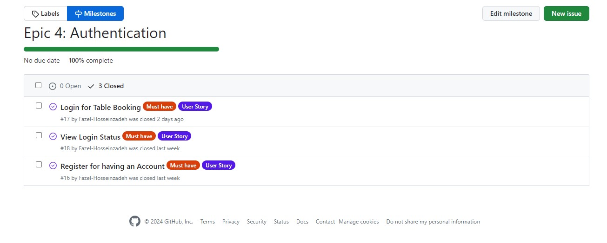
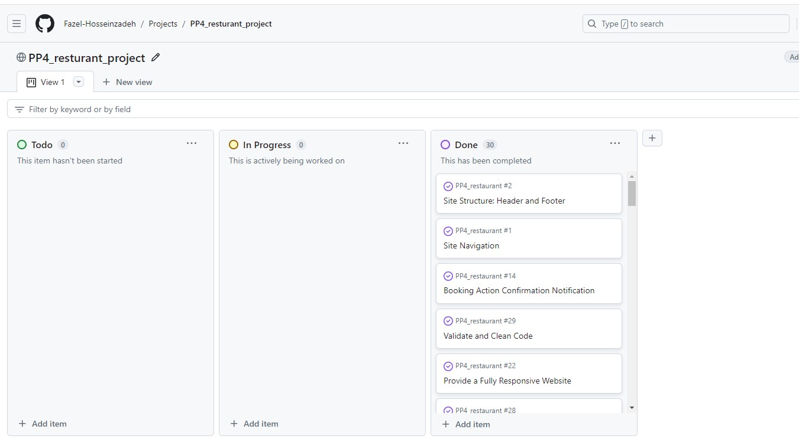

# Black Forest Restaurant

[Visit live website](https://pp4-restaurant-blackforest-8f755e627638.herokuapp.com/)

## Table of Contents
- [About](#about)
- [User Goals](#user-goals)
- [Site Owner Goals](#site-owner-goals)
- [User Requirements and Expectations](#user-requirements-and-expectations)
- [Target Audience](#target-audience)
- [User Stories](#user-stories)
- [Design](#design)
- [Frontend Technologies](#frontend-technologies)
- [Backend Technologies](#backend-technologies)
- [Development and Testing Tools](#development-and-testing-tools)
- [Features](#features)

---
### About

The Black Forest Restaurant is a web application that provides a platform for customers to explore the restaurant's menus and blog, make reservations, and contact them.

[Go up](#table-of-contents)

---

### User Goals

-   Create, view, edit, and cancel table bookings.
-   Explore the restaurant's food and drink offerings.
-   Stay informed about the restaurant through the blog.
-   Easily find contact information.

[Go up](#table-of-contents)
  
  ---

### Site Owner Goals

-   Provide an efficient online table booking system.
-   Enhance the restaurant's online presence and attract new customers.
-   Deliver a user-friendly and visually appealing website.
-   Ensure accessibility and responsiveness across different devices.
  
  [Go up](#table-of-contents)
  
  ---

### User Requirements and Expectations

- Easy booking process: A clear and intuitive booking flow.
- Real-time availability: Up-to-date information on table availability.
- Payment options: Various payment methods for reservations (if applicable).
- Customer support: Clear contact information and support channels.
- Personalization: Options for user preferences (e.g., dietary restrictions, table size).
- Mobile optimization: A seamless experience on mobile devices.
- Visual appeal: High-quality images and engaging design.
- Performance: Fast loading times and smooth interactions.

[Go up](#table-of-contents)

---

### Target Audience

- Leisure diners: Individuals or groups seeking a dining experience for leisure. This includes families, friends, and couples.
- Business professionals: People looking for a place to dine during or after work
- Tourists: Visitors to the area seeking dining options.
- Event attendees: People in town for special events such as concerts or sporting events.

[Go up](#table-of-contents)

---

### User Stories

#### Users
- As a User I can navigate across the site so that I can move to each page of the site easily
- As a User I can use a navbar, footer, and social icons so that I can navigate the site, access menus, and access socials
- As a User I can view the opening hours and contact details of a business so that I know when the business is open and how to contact them via email, phone and social media.
- As a User I can create a booking by selecting a date and time so that I can reserve a table for my desired visit.
- As a User I can update my existing booking so that I can choose another available time and date if needed.
- As a User I can delete my existing booking so that I can cancel my table reservation.
- As a User I can view the details of my booking so that I can remind myself of the date, time, and any other relevant information about my booking.
- As a User I can be notified of the successful creation, edit, or deletion of a booking so that I know the action I took has been processed successfully.
- As a User I can register as prompted during the booking process so that I will be able to easily book a table or make a reservation if I wish.
- As a User I can register to create an account so that my details are stored for quicker booking in the future.
- As a User I can log in to the website so that I can book a table at the business.
- As a User I can see my login status so that I know if I am currently logged in to the website.
- As a User I can view the site's blog posts so that I can learn additional information and read articles on a variety of topics.
- As a User I can view the food and drink menu of a business so that I can decide whether to eat or drink at the establishment.
- As a User I can not book a date in the past so that my booking is valid and reflects a future appointment.
- As a User I can view blog posts paginated so that I can browse through a large number of posts without feeling overwhelmed.
- As a User I can not book a table that is already booked so that my booking is valid and I am not placed at a table that is unavailable.

#### Admin / Authorised User

- As an Admin or Authorized User I can log in to the website so that I can access the back-end of the site and perform administrative tasks.
- As an Admin / Authorised User I can manually add or edit or delete a booking so that I can book/cancel/modify a table for a customer who phones or emails the business.
- As an Admin / Authorised User I can accept or reject bookings so that we can manage availability and avoid double bookings.
- As an Admin I can login and manage the food and cocktail menu by adding or removing items so that we can keep the menu updated with new offerings and remove unavailable items.
- As an Admin I can create, read, update, and delete food and drinks items from the database so that we can add, remove, rename, and view all our food and drinks offerings.
- As an Admin / Authorised User I can search through bookings and menus so that I can find the information I need efficiently.
- As an Admin / Authorized User I can filter bookings by date so that I can see what bookings we have for a particular day.

#### Site Owner

- As a Site Owner I can provide a contact us form so that users can get in touch with me.
- As a Site Owner I can provide a fully responsive website for my customers so that they have a good user experience regardless of the device they are using (desktop, tablet, mobile phone).
- As a Site Owner I can validate data entered into my site so that all submitted data is correct and avoids errors in my system.

### Github Kanban and Epic
- A GitHub Kanban board was utilized to visualize and track user stories throughout their lifecycle.
- Epics representing larger bodies of work were managed through GitHub's milestone feature. 

Epics

User Stories

Kanban

[Go up](#table-of-contents)

---

### Design

#### Color Scheme

- The project employs a dark theme primarily based on the Bootstrap 5 framework. This provides a consistent and visually appealing color palette throughout the application.

####  Website Structure
The website features a consistent layout across pages, including a top navigation bar and a hamburger menu for smaller screens. The footer displays social media links for enhanced user engagement.

##### Core Pages
- Home: The entry point, showcasing key features through interactive cards for booking, menu exploration, and blog access.

- Menus: Presents food and drink options categorized into starters, mains, desserts, wines, beers, and cocktails.
- Blog: Displays a paginated list of blog posts with detailed views and commenting functionality for registered users.
- Booking: Enables registered users to create, view, edit, and cancel reservations and see theeir reservaion list.
- Contact Us: Provides contact information and a contact form for unregistered user inquiries.
User Management: Includes login, registration, and logout functionalities.

####  Database

The website utilizes a robust backend built with Python and the Django framework. Data is persisted in a PostgreSQL database hosted on [ElephantSQL](https://www.elephantsql.com/docs/index.html) and deployed on [Heroku](https://www.heroku.com/).

##### Models

###### User
Django builtin model and has following fields:
- user_id
- password
- last_login
- is_superuser
- username
- first_name
- last_name
- email
- is_staff
- is_active
- date_joined

###### FoodItem
This model has following fields:
- food_name
- description
- price
- food_type
- available

###### DrinkItem
This model has following fields:
- drink_name
- description
- price
- drink_type
- available

###### Post
This model has following fields:
- title
- slug
- author(ForeignKey)
- content
- created_on
- status
- excerpt
- updated_on

###### Comment
This model has following fields:
- post(ForeignKey)
- author(ForeignKey)
- body
- created_on
- approved

###### Table
This model has following fields:
- table_name
- max_seats

###### Booking
This model has following fields:
- user(ForeignKey)
- name
- email
- phone
- status
- seats
- guest_count
- created_date
- requested_date
- requested_time
- table(ForeignKey)

###### ContactContent
This model has following fields:
- title
- updated_on
- content

###### ContactMessage
This model has following fields:
- name
- email
- message
- read

[Go up](#table-of-contents)

---

### Frontend Technologies

#### Languages
- HTML: Provides the core structure and content of the webpages.
- JavaScript: Enhances interactivity and user experience with dynamic elements.

####  Libraries & Tools:
- Bootstrap v5.2: A popular CSS framework for rapid and responsive web development.
- Font Awesome: Extensive collection of icons for visual appeal.
- Chrome DevTools: Essential browser debugging tools for inspecting and optimizing the frontend.
- Favicon.io: Simplifies the creation and deployment of website favicons.

[Go up](#table-of-contents)

---

### Backend Technologies
####  Languages & Frameworks:
- Python: A versatile programming language powering the backend logic.
- Django: A high-level Python web framework facilitating rapid development.
##### Libraries & Tools:
- Postgres: A widely-used relational database management system for data persistence.
- Cloudinary: Cloud-based platform for managing images and other media assets.
- Summernote: A WYSIWYG editor for creating and editing blog content within the admin panel.

[Go up](#table-of-contents)

---

### Development and Testing Tools
####  Version Control:
- Git: A distributed version control system for managing code changes and collaboration.
- GitHub: A popular hosting platform for Git repositories and code collaboration.
####  Validation:
- WC3 Validators (HTML & CSS): Tools for ensuring code adheres to web standards.
- JShint & Pycodestyle (PEP8): Static code analysis tools for identifying potential errors in JavaScript and Python code.
- Lighthouse: Google's tool for auditing web performance, accessibility, and best practices.
- Wave Validator: Tool for evaluating web content accessibility for users with disabilities.

[Go up](#table-of-contents)

---

###  Features

####  Core Functionalities
- Layout: Consistent layout across pages with a top navigation bar and a responsive hamburger menu for smaller screens.
- Logo: Custom logo displayed prominently on all pages.
- User Authentication: Secure login, registration, and logout functionalities.

Navigation Bar

Navigation bar

Hamburger Button

Logo

User Authentication

Login

Logout

Register

- Footer: Includes social media links and copyright information.

Footer

####  Booking System
- Table Reservations: Users can book tables with specified guest count, date, and time.
- Booking Management: Users can view, edit, and cancel their bookings.
- Booking Status: Users can be informed from My Bookings section about the status of their bookings.

Booking

Table Reservations

My Bookings

####  Content Management
- Blog: Features blog posts with pagination, Post detailed views, and commenting functionality.
- Comment Moderation: Admin approval process for comments to ensure quality control.

Blog

Post Lists

Post Detail

Post Comment

####  Contact
- Contact Form: Allows users to send messages to the business.
- Contact Information: Provide other contact ways

Contact Us

Contact Content

Contact Form

####  Additional Features
- Pagination: Implemented for blog posts to enhance user experience.
- Responsive Design: Ensures optimal viewing on various devices.
- Social Media Integration: Includes links to social media platforms for increased visibility.

####  Visual Elements
- Image Integration: Utilizes images for branding, blog posts, and other visual enhancements.
- Design Consistency: Maintains a cohesive visual style throughout the website.

