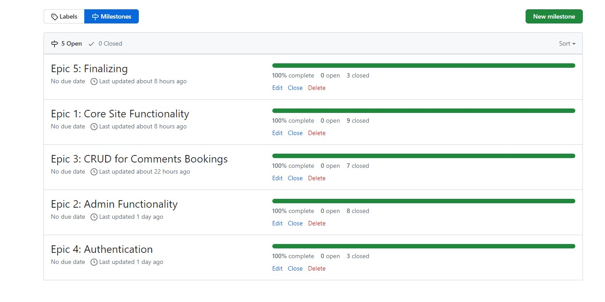

# Black Forest Restaurant

[Visit live website](https://pp4-restaurant-blackforest-8f755e627638.herokuapp.com/)

## Table of Contents
- [About](#about)
- [User Goals](#user-goals)
- [Site Owner Goals](#site-owner-goals)
- [User Requirements and Expectations](#user-requirements-and-expectations)
- [Target Audience](target-audience)
- [User Stories](#user-stories)

---
### About

The Black Forest Restaurant is a web application that provides a platform for customers to explore the restaurant's menus and blog, make reservations, and contact them.

[Go up](#table-of-contents)

---

### User Goals

-   Create, view, edit, and cancel table bookings.
-   Explore the restaurant's food and drink offerings.
-   Stay informed about the restaurant through the blog.
-   Easily find contact information.

[Go up](#table-of-contents)
  
  ---

### Site Owner Goals

-   Provide an efficient online table booking system.
-   Enhance the restaurant's online presence and attract new customers.
-   Deliver a user-friendly and visually appealing website.
-   Ensure accessibility and responsiveness across different devices.
  
  [Go up](#table-of-contents)
  
  ---

### User Requirements and Expectations

- Easy booking process: A clear and intuitive booking flow.
- Real-time availability: Up-to-date information on table availability.
- Payment options: Various payment methods for reservations (if applicable).
- Customer support: Clear contact information and support channels.
- Personalization: Options for user preferences (e.g., dietary restrictions, table size).
- Mobile optimization: A seamless experience on mobile devices.
- Visual appeal: High-quality images and engaging design.
- Performance: Fast loading times and smooth interactions.

[Go up](#table-of-contents)

---

### Target Audience

- Leisure diners: Individuals or groups seeking a dining experience for leisure. This includes families, friends, and couples.
- Business professionals: People looking for a place to dine during or after work
- Tourists: Visitors to the area seeking dining options.
- Event attendees: People in town for special events such as concerts or sporting events.

[Go up](#table-of-contents)

---

### User Stories

#### Users
- As a User I can navigate across the site so that I can move to each page of the site easily
- As a User I can use a navbar, footer, and social icons so that I can navigate the site, access menus, and access socials
- As a User I can view the opening hours and contact details of a business so that I know when the business is open and how to contact them via email, phone and social media.
- As a User I can create a booking by selecting a date and time so that I can reserve a table for my desired visit.
- As a User I can update my existing booking so that I can choose another available time and date if needed.
- As a User I can delete my existing booking so that I can cancel my table reservation.
- As a User I can view the details of my booking so that I can remind myself of the date, time, and any other relevant information about my booking.
- As a User I can be notified of the successful creation, edit, or deletion of a booking so that I know the action I took has been processed successfully.
- As a User I can register as prompted during the booking process so that I will be able to easily book a table or make a reservation if I wish.
- As a User I can register to create an account so that my details are stored for quicker booking in the future.
- As a User I can log in to the website so that I can book a table at the business.
- As a User I can see my login status so that I know if I am currently logged in to the website.
- As a User I can view the site's blog posts so that I can learn additional information and read articles on a variety of topics.
- As a User I can view the food and drink menu of a business so that I can decide whether to eat or drink at the establishment.
- As a User I can not book a date in the past so that my booking is valid and reflects a future appointment.
- As a User I can view blog posts paginated so that I can browse through a large number of posts without feeling overwhelmed.
- As a User I can not book a table that is already booked so that my booking is valid and I am not placed at a table that is unavailable.

#### Admin / Authorised User

- As an Admin or Authorized User I can log in to the website so that I can access the back-end of the site and perform administrative tasks.
- As an Admin / Authorised User I can manually add or edit or delete a booking so that I can book/cancel/modify a table for a customer who phones or emails the business.
- As an Admin / Authorised User I can accept or reject bookings so that we can manage availability and avoid double bookings.
- As an Admin I can login and manage the food and cocktail menu by adding or removing items so that we can keep the menu updated with new offerings and remove unavailable items.
- As an Admin I can create, read, update, and delete food and drinks items from the database so that we can add, remove, rename, and view all our food and drinks offerings.
- As an Admin / Authorised User I can search through bookings and menus so that I can find the information I need efficiently.
- As an Admin / Authorized User I can filter bookings by date so that I can see what bookings we have for a particular day.

#### Site Owner

- As a Site Owner I can provide a contact us form so that users can get in touch with me.
- As a Site Owner I can provide a fully responsive website for my customers so that they have a good user experience regardless of the device they are using (desktop, tablet, mobile phone).
- As a Site Owner I can validate data entered into my site so that all submitted data is correct and avoids errors in my system.

### Github Kanban and Epic
- A GitHub Kanban board was utilized to visualize and track user stories throughout their lifecycle.
- Epics representing larger bodies of work were managed through GitHub's milestone feature. 

Epics

User Stories

Kanban

[Go up](#table-of-contents)

---
