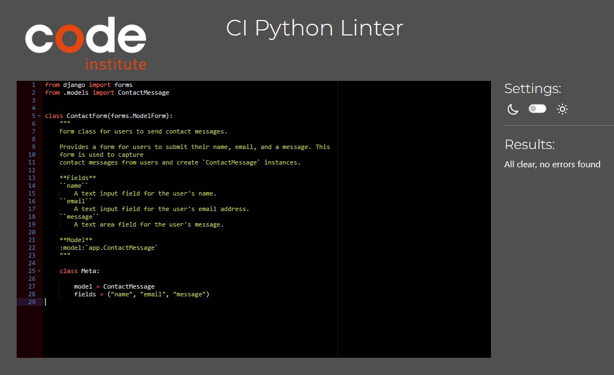
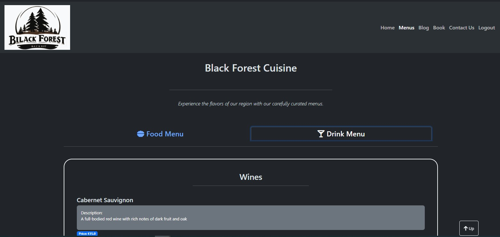

# Black Forest Restaurant

[Visit live website](https://pp4-restaurant-blackforest-8f755e627638.herokuapp.com/)

## Table of Contents
- [About](#about)
- [User Goals](#user-goals)
- [Site Owner Goals](#site-owner-goals)
- [User Requirements and Expectations](#user-requirements-and-expectations)
- [Target Audience](#target-audience)
- [User Stories](#user-stories)
- [Design](#design)
- [Frontend Technologies](#frontend-technologies)
- [Backend Technologies](#backend-technologies)
- [Development and Testing Tools](#development-and-testing-tools)
- [Features](#features)
- [Validations](#validations)
- [Bugs](#bugs)
- [Heroku Deployment Guide](#heroku-deployment-guide)
- [Fork a Repository](#fork-a-repository)
- [Credits](#credits)

---
### About

The Black Forest Restaurant is a web application that provides a platform for customers to explore the restaurant's menus and blog, make reservations, and contact them.

[Go up](#table-of-contents)

---

### User Goals

-   Create, view, edit, and cancel table bookings.
-   Explore the restaurant's food and drink offerings.
-   Stay informed about the restaurant through the blog.
-   Easily find contact information.

[Go up](#table-of-contents)
  
  ---

### Site Owner Goals

-   Provide an efficient online table booking system.
-   Enhance the restaurant's online presence and attract new customers.
-   Deliver a user-friendly and visually appealing website.
-   Ensure accessibility and responsiveness across different devices.
  
  [Go up](#table-of-contents)
  
  ---

### User Requirements and Expectations

- Easy booking process: A clear and intuitive booking flow.
- Real-time availability: Up-to-date information on table availability.
- Payment options: Various payment methods for reservations (if applicable).
- Customer support: Clear contact information and support channels.
- Personalization: Options for user preferences (e.g., dietary restrictions, table size).
- Mobile optimization: A seamless experience on mobile devices.
- Visual appeal: High-quality images and engaging design.
- Performance: Fast loading times and smooth interactions.

[Go up](#table-of-contents)

---

### Target Audience

- Leisure diners: Individuals or groups seeking a dining experience for leisure. This includes families, friends, and couples.
- Business professionals: People looking for a place to dine during or after work
- Tourists: Visitors to the area seeking dining options.
- Event attendees: People in town for special events such as concerts or sporting events.

[Go up](#table-of-contents)

---

### User Stories

#### Users
1. As a User I can navigate across the site so that I can move to each page of the site easily
2.  As a User I can use a navbar, footer, and social icons so that I can navigate the site, access menus, and access socials
3. As a User I can view the opening hours and contact details of a business so that I know when the business is open and how to contact them via email, phone and social media.
4. As a User I can create a booking by selecting a date and time so that I can reserve a table for my desired visit.
5. As a User I can update my existing booking so that I can choose another available time and date if needed.
6. As a User I can delete my existing booking so that I can cancel my table reservation.
7. As a User I can view the details of my booking so that I can remind myself of the date, time, and any other relevant information about my booking.
8. As a User I can be notified of the successful creation, edit, or deletion of a booking so that I know the action I took has been processed successfully.
9. As a User I can register as prompted during the booking process so that I will be able to easily book a table or make a reservation if I wish.
10. As a User I can register to create an account so that my details are stored for quicker booking in the future.
11. As a User I can log in to the website so that I can book a table at the business.
12. As a User I can see my login status so that I know if I am currently logged in to the website.
13. As a User I can view the site's blog posts so that I can learn additional information and read articles on a variety of topics.
14. As a User I can view the food and drink menu of a business so that I can decide whether to eat or drink at the establishment.
15. As a User I can not book a date in the past so that my booking is valid and reflects a future appointment.
16. As a User I can view blog posts paginated so that I can browse through a large number of posts without feeling overwhelmed.
17. As a User I can not book a table that is already booked so that my booking is valid and I am not placed at a table that is unavailable.

#### Admin / Authorised User

18. As an Admin or Authorized User I can log in to the website so that I can access the back-end of the site and perform administrative tasks.
19. As an Admin / Authorised User I can manually add or edit or delete a booking so that I can book/cancel/modify a table for a customer who phones or emails the business.
20. As an Admin / Authorised User I can accept or reject bookings so that we can manage availability and avoid double bookings.
21. As an Admin I can login and manage the food and cocktail menu by adding or removing items so that we can keep the menu updated with new offerings and remove unavailable items.
22. As an Admin I can create, read, update, and delete food and drinks items from the database so that we can add, remove, rename, and view all our food and drinks offerings.
23. As an Admin / Authorised User I can search through bookings and menus so that I can find the information I need efficiently.
24. As an Admin / Authorized User I can filter bookings by date so that I can see what bookings we have for a particular day.

#### Site Owner

25. As a Site Owner I can provide a contact us form so that users can get in touch with me.
26. As a Site Owner I can provide a fully responsive website for my customers so that they have a good user experience regardless of the device they are using (desktop, tablet, mobile phone).
27. As a Site Owner I can validate data entered into my site so that all submitted data is correct and avoids errors in my system.

### Github Kanban and Epic
- A GitHub Kanban board was utilized to visualize and track user stories throughout their lifecycle.
- Epics representing larger bodies of work were managed through GitHub's milestone feature. 

Epics

User Stories

Kanban

[Go up](#table-of-contents)

---

### Design

#### Color Scheme

- The project employs a dark theme primarily based on the Bootstrap 5 framework. This provides a consistent and visually appealing color palette throughout the application.

####  Website Structure
The website features a consistent layout across pages, including a top navigation bar and a hamburger menu for smaller screens. The footer displays social media links for enhanced user engagement.

##### Core Pages
- Home: The entry point, showcasing key features through interactive cards for booking, menu exploration, and blog access.

- Menus: Presents food and drink options categorized into starters, mains, desserts, wines, beers, and cocktails.
- Blog: Displays a paginated list of blog posts with detailed views and commenting functionality for registered users.
- Booking: Enables registered users to create, view, edit, and cancel reservations and see theeir reservaion list.
- Contact Us: Provides contact information and a contact form for unregistered user inquiries.
User Management: Includes login, registration, and logout functionalities.

####  Database

The website utilizes a robust backend built with Python and the Django framework. Data is persisted in a PostgreSQL database hosted on [ElephantSQL](https://www.elephantsql.com/docs/index.html) and deployed on [Heroku](https://www.heroku.com/).

##### Models

###### User
Django builtin model and has following fields:
- user_id
- password
- last_login
- is_superuser
- username
- first_name
- last_name
- email
- is_staff
- is_active
- date_joined

---

###### FoodItem
This model has following fields:
- food_name
- description
- price
- food_type
- available

###### DrinkItem
This model has following fields:
- drink_name
- description
- price
- drink_type
- available

FoodItem and DrinkItem Models

---

###### Post
This model has following fields:
- title
- slug
- author(ForeignKey)
- content
- created_on
- status
- excerpt
- updated_on

###### Comment
This model has following fields:
- post(ForeignKey)
- author(ForeignKey)
- body
- created_on
- approved

Post and Comment Models

---

###### Table
This model has following fields:
- table_name
- max_seats

###### Booking
This model has following fields:
- user(ForeignKey)
- name
- email
- phone
- status
- seats
- guest_count
- created_date
- requested_date
- requested_time
- table(ForeignKey)

Table and Booking Models

---

###### ContactContent
This model has following fields:
- title
- updated_on
- content

###### ContactMessage
This model has following fields:
- name
- email
- message
- read

ContactContent and ContactMessage Models

 

[Go up](#table-of-contents)

---

### Frontend Technologies

#### Languages
- HTML: Provides the core structure and content of the webpages.
- JavaScript: Enhances interactivity and user experience with dynamic elements.

####  Libraries & Tools:
- Bootstrap v5.2: A popular CSS framework for rapid and responsive web development.
- Font Awesome: Extensive collection of icons for visual appeal.
- Chrome DevTools: Essential browser debugging tools for inspecting and optimizing the frontend.
- Favicon.io: Simplifies the creation and deployment of website favicons.

[Go up](#table-of-contents)

---

### Backend Technologies
####  Languages & Frameworks:
- Python: A versatile programming language powering the backend logic.
- Django: A high-level Python web framework facilitating rapid development.
##### Libraries & Tools:
- Postgres: A widely-used relational database management system for data persistence.
- Cloudinary: Cloud-based platform for managing images and other media assets.
- Summernote: A WYSIWYG editor for creating and editing blog content within the admin panel.

[Go up](#table-of-contents)

---

### Development and Testing Tools
####  Version Control:
- Git: A distributed version control system for managing code changes and collaboration.
- GitHub: A popular hosting platform for Git repositories and code collaboration.
####  Validation:
- WC3 Validators (HTML & CSS): Tools for ensuring code adheres to web standards.
- JShint & Pycodestyle (PEP8): Static code analysis tools for identifying potential errors in JavaScript and Python code.
- Lighthouse: Google's tool for auditing web performance, accessibility, and best practices.
- Wave Validator: Tool for evaluating web content accessibility for users with disabilities.

[Go up](#table-of-contents)

---

###  Features

####  Core Functionalities
- Layout: Consistent layout across pages with a top navigation bar and a responsive hamburger menu for smaller screens.

User stories covered: 1, 2
 

- Logo: Custom logo displayed prominently on all pages.
User stories covered: 1, 2
 

- User Authentication: Secure login, registration, and logout functionalities.

User stories covered: 9, 10, 11, 12
 

Navigation Bar

Navigation bar

Hamburger Button

Logo

User Authentication

Login

Logout

Register

 
- Footer: Includes social media links and copyright information.
User stories covered: 2, 3
 

Footer

####  Booking System
- Table Reservations: Users can book tables with specified guest count, date, and time.

User stories covered: 4
 

- Booking Management: Users can view, edit, and cancel their bookings.

User stories covered: 5, 6, 7
 

- Booking Status: Users can be informed from My Bookings section about the status of their bookings.
User stories covered: 8, 17
 

Booking

Table Reservations

My Bookings

####  Content Management
- Blog: Features blog posts with pagination, Post detailed views, and commenting functionality.

User stories covered: 13, 16
 

- Comment Moderation: Admin approval process for comments to ensure quality control.

User stories covered: 18
 

Blog

Post Lists

Post Detail

Post Comment

####  Contact
- Contact Form: Allows users to send messages to the business.
User stories covered: 25
 

- Contact Information: Provide other contact ways
User stories covered: 3
 

Contact Us

Contact Content

Contact Form

####  Additional Features
- Pagination: Implemented for blog posts to enhance user experience.
User stories covered: 16
 

- Responsive Design: Ensures optimal viewing on various devices.
User stories covered: 26
 

- Social Media Integration: Includes links to social media platforms for increased visibility.
User stories covered: 2
 

####  Visual Elements
- Image Integration: Utilizes images for branding, blog posts, and other visual enhancements.
User stories covered: 2, 3, 13, 14, 25
 

- Design Consistency: Maintains a cohesive visual style throughout the website.
User stories covered: 1, 2, 26
 

[Go up](#table-of-contents)

---

### Validations

#### Markup Validation: 
The [W3C](https://validator.w3.org/nu/) Markup Validation Service has been used

Home

Menus

Blog

Post Detail

Book

Edit / Delete Booking

Contact Us

Register

Login

Logout

### JavaScript Validation
JSHint JS Validation Service

comment.js

### PEP8 Validation
[CI PEP8](https://pep8ci.herokuapp.com/) Validation Service has been used for python files in the bellow apps:

Home

Admin.py

models.py

urls.py

views.py

Menus

Admin.py

models.py

urls.py

views.py

Blog

Admin.py

models.py

urls.py

views.py

forms.py

Book

Admin.py

models.py

urls.py

views.py

forms.py

Contact

Admin.py

models.py

urls.py

views.py

forms.py

### Lighthouse
The Lighthouse has been tested on bellow templates
#### Desktop

home

Menus

Blog

Post Detail

Book

Book Edit

Contact Us

#### Mobile

home

Menus

Blog

Post Detail

Book

Book Edit

Contact Us

### Wave
For websites accessibility has been used.

home

Menus

Blog

Post Detail

Book

Contact Us

[Go up](#table-of-contents)

---

## Testing
- All the tests are done manually.

1. As a User I can navigate across the site so that I can move to each page of the site easily

**Step** | **Expected Result** | **Actual Result**
------------ | ------------ | ------------ |
| Click on the 'Home' link in the navigation bar | Homepage will load| Works as expected |
| Click on the 'Menus' link in the navigation bar | Food and Drinkss will load| Works as expected |
| In the Menus page click on the 'Foods' Tab| Food menu will load| Works as expected |
| In the Menus page click on the 'Drinks' Tab| Drink menu will load| Works as expected |
| Click on the 'Blog' link in the navigation bar | Blog page will load| Works as expected |
| In the 'Blog' Page click on a 'Post'| 'Post Detail' page will load| Works as expected |
| Click on the 'Book' link in the navigation bar | Reservations page will load| Works as expected |
| In the 'reservation' page click on the 'Book a Table' Tab | 'Booking Form' will load| Works as expected |
| In the 'reservation' page click on the 'My Bookings' Tab | 'My Booking' list will load| Works as expected |
| Click on the 'Contact Us' link in the navigation bar | Contact us page will load| Works as expected |
| Click on the 'Register' link in the navigation bar | Sign up page will load| Works as expected |
| Click on the 'Login' link in the navigation bar | Login page will load| Works as expected |
| Click on the 'Logout' link in the navigation bar | Logout page will load| Works as expected |

Test 1

2.  As a User I can use a navbar, footer, and social icons so that I can navigate the site, access menus, and access socials

**Step** | **Expected Result** | **Actual Result**
------------ | ------------ | ------------ |
 | For Navbar see Test 1 | For Navbar see Test 1 | Works as expected |
 | Scroll Media links in the footer at bottom of page | Click on social  Media links | Works as expected |

 

Test 2

3. As a User I can view the opening hours and contact details of a business so that I know when the business is open and how to contact them via email, phone and social media.

**Step** | **Expected Result** | **Actual Result**
------------ | ------------ | ------------ |
 | For Social Media Test see Test 2 | For Social Media Test see Test 2 | Works as expected |
 | Navigate to Contact Us page | See the contact informations and contact form | Works as expected |

 

Test 3

4. As a User I can create a booking by selecting a date and time so that I can reserve a table for my desired visit.

**Step** | **Expected Result** | **Actual Result**
------------ | ------------ | ------------ |
 | Navigate to Book page and then click on Book a Table tab| See the booking form | Works as expected |

 

Test 4

5. As a User I can update my existing booking so that I can choose another available time and date if needed.

**Step** | **Expected Result** | **Actual Result**
------------ | ------------ | ------------ |
 | Navigate to Book page and then click on My Bookings tab then click on Edit button| See the booking form alreay filled with old info ready to be changed | Works as expected |

 

Test 5

6. As a User I can delete my existing booking so that I can cancel my table reservation.

**Step** | **Expected Result** | **Actual Result**
------------ | ------------ | ------------ |
 | Navigate to Book page and then click on My Bookings tab then click on Delete button, then in the modal form click on delete| Seeing that the booking is removed from my booking list | Works as expected |

 

Test 6

7. As a User I can view the details of my booking so that I can remind myself of the date, time, and any other relevant information about my booking.

**Step** | **Expected Result** | **Actual Result**
------------ | ------------ | ------------ |
 | Navigate to Book page and then click on My Bookings tab | Seeing that the booking is removed from my booking list | Works as expected |

 

Test 7

8. As a User I can be notified of the successful creation, edit, or deletion of a booking so that I know the action I took has been processed successfully.

**Step** | **Expected Result** | **Actual Result**
------------ | ------------ | ------------ |
 | Navigate to Book page and make reservation | Seeing a message to tell either the booking was successfull or not | Works as expected |
 | Navigate to Book page and update a reservation | Seeing a message to tell either the updating was successfull or not | Works as expected |
  | Navigate to Book page and dlete a reservation | Seeing a message to tell either the delete was successfull or not | Works as expected |

 

Test 8

9. As a User I can register as prompted during the booking process so that I will be able to easily book a table or make a reservation if I wish.

**Step** | **Expected Result** | **Actual Result**
------------ | ------------ | ------------ |
 | Navigate to Register page and fill up the form correctly and sign up | Seeing a notification of successful signed up and beeing loged in | Works as expected |

Test 9

10. As a User I can register to create an account so that my details are stored for quicker booking in the future.

**Step** | **Expected Result** | **Actual Result**
------------ | ------------ | ------------ |
 | Navigate to Booking page and My Bookings tab, if you are not loged in you can use a link to redirect you to log in page | Seeing a loged in button | Works as expected |
  | Navigate to Booking page and Book a Table tab, if you are not loged in you can use a link to redirect you to log in page | Seeing a loged in button | Works as expected |

Test 10

11. As a User I can log in to the website so that I can book a table at the business.

**Step** | **Expected Result** | **Actual Result**
------------ | ------------ | ------------ |
 | Navigate to login page and login, then navigate to book page and Book a Table tab | Seeing booking form | Works as expected |

Test 11

12. As a User I can see my login status so that I know if I am currently logged in to the website.

**Step** | **Expected Result** | **Actual Result**
------------ | ------------ | ------------ |
 | Navigate to login page and login | Seeing a notification that successfully loged in | Works as expected |

Test 12

13. As a User I can view the site's blog posts so that I can learn additional information and read articles on a variety of topics.

**Step** | **Expected Result** | **Actual Result**
------------ | ------------ | ------------ |
 | Navigate to blog page and then use pagination to find your desired post and click on it | Seeing the list of posts and after clicking on a post seeing the datail of the post| Works as expected |

Test 13

14. As a User I can view the food and drink menu of a business so that I can decide whether to eat or drink at the establishment.

**Step** | **Expected Result** | **Actual Result**
------------ | ------------ | ------------ |
 | Navigate to Menus page and then choose either food menu or drink menu tab | Seeing the food menu or drink menue related to tab you clicked| Works as expected |

Test 14

15. As a User I can not book a date in the past so that my booking is valid and reflects a future appointment.

**Step** | **Expected Result** | **Actual Result**
------------ | ------------ | ------------ |
 | Navigate to Book page and then choose Book a Table tab | Seeing in the date picker you can choose from tomorrow and after| Works as expected |

Test 15

16. As a User I can view blog posts paginated so that I can browse through a large number of posts without feeling overwhelmed.

**Step** | **Expected Result** | **Actual Result**
------------ | ------------ | ------------ |
 | Navigate to Blog page | Seeing the list of posts paginated 3 posts per page| Works as expected |

Test 16

17. As a User I can not book a table that is already booked so that my booking is valid and I am not placed at a table that is unavailable.

**Step** | **Expected Result** | **Actual Result**
------------ | ------------ | ------------ |
 | Navigate to Book page and Book a Table tab and reserve a date and time and a table which you reserved before| Seeing an unsuccessful notification which says this table already reserved| Works as expected |

Test 17

#### Admin / Authorised User

18. As an Admin or Authorized User I can log in to the website so that I can access the back-end of the site and perform administrative tasks.

**Step** | **Expected Result** | **Actual Result**
------------ | ------------ | ------------ |
 | Navigate to [Admin page](https://pp4-restaurant-blackforest-8f755e627638.herokuapp.com/admin/login/?next=/admin/) and login| Seeing an successful login and admin panel | Works as expected |

Test 18

19. As an Admin / Authorised User I can manually add or edit or delete a booking so that I can book/cancel/modify a table for a customer who phones or emails the business.

**Step** | **Expected Result** | **Actual Result**
------------ | ------------ | ------------ |
 | Navigate to [Admin page](https://pp4-restaurant-blackforest-8f755e627638.herokuapp.com/admin/login/?next=/admin/) and login and then on the side bar click on Bookings and ADD or change a booking| Seeing a form to add a booking or a list of bookings that you can edit them| Works as expected |

Test 19

20. As an Admin / Authorised User I can accept or reject bookings so that we can manage availability and avoid double bookings.

**Step** | **Expected Result** | **Actual Result**
------------ | ------------ | ------------ |
 | Navigate to [Admin page](https://pp4-restaurant-blackforest-8f755e627638.herokuapp.com/admin/login/?next=/admin/) and login and then on the side bar click on Bookings and choose desired booking and on the status field you can choose the desired action for that booking| Seeing change of the status on that booking | Works as expected |

Test 20

21. As an Admin I can login and manage the food and cocktail menu by adding or removing items so that we can keep the menu updated with new offerings and remove unavailable items.

**Step** | **Expected Result** | **Actual Result**
------------ | ------------ | ------------ |
 | Navigate to [Admin page](https://pp4-restaurant-blackforest-8f755e627638.herokuapp.com/admin/login/?next=/admin/) and login and then on the side bar click on Drink Itemes or Food Items and click on Add or Change to Add or Edit the Items| Seeing a form to add or edit Food or Drink Items | Works as expected |

Test 21

22. As an Admin I can create, read, update, and delete food and drinks items from the database so that we can add, remove, rename, and view all our food and drinks offerings.

**Step** | **Expected Result** | **Actual Result**
------------ | ------------ | ------------ |
 | Navigate to [Admin page](https://pp4-restaurant-blackforest-8f755e627638.herokuapp.com/admin/login/?next=/admin/) and login and then on the side bar click on Drink Itemes or Food Items and click on Change to Edit the Items| Seeing a list of stored data as foods or drink items and click on them to edit them in a from | Works as expected |

Test 22

23. As an Admin / Authorised User I can search through bookings and menus so that I can find the information I need efficiently.

**Step** | **Expected Result** | **Actual Result**
------------ | ------------ | ------------ |
 | Navigate to [Admin page](https://pp4-restaurant-blackforest-8f755e627638.herokuapp.com/admin/login/?next=/admin/) and login and then on the side bar click on Drink Itemes or Food Items or Bookings then you should be able to see filters and search bar on the right side or top of the page | Seeing filters and search bars in the Bookings, Food Items and Drink Items | Works as expected |

Test 23

24. As an Admin / Authorized User I can filter bookings by date so that I can see what bookings we have for a particular day.

**Step** | **Expected Result** | **Actual Result**
------------ | ------------ | ------------ |
 | Navigate to [Admin page](https://pp4-restaurant-blackforest-8f755e627638.herokuapp.com/admin/login/?next=/admin/) and login and then on the side bar click on Bookings then on the right there is a filter sied bar add the start and end of the period which  you are looking for| Seeing a list of which are booked only on that perid | Works as expected |

Test 24

#### Site Owner

25. As a Site Owner I can provide a contact us form so that users can get in touch with me.

**Step** | **Expected Result** | **Actual Result**
------------ | ------------ | ------------ |
 | Navigate to [Admin page](https://pp4-restaurant-blackforest-8f755e627638.herokuapp.com/admin/login/?next=/admin/) and login and then on the side bar click on Contact Content Add then fill up the form as a content which will be appear on the Contact Us page| Seeing a for of Contact content | Works as expected |

Test 25

26. As a Site Owner I can validate data entered into my site so that all submitted data is correct and avoids errors in my system.

**Step** | **Expected Result** | **Actual Result**
------------ | ------------ | ------------ |
 | Navigate to Book page and book a Table form and insert an unvalid data| Seeing a notification saying the data inserted is not correct | Works as expected |

Test 26

[Go up](#table-of-contents)

---

### Bugs

- When deleting a booking if you double click then server error will happen.

Bog

[Go up](#table-of-contents)

---

### Heroku Deployment Guide

This guide outlines the steps to deploy an application from GitHub to Heroku.

1.  Create a Heroku Account

2.  Create a Heroku App
- Name your app (e.g., my-heroku-app) and select a region.

3.  Make an env.py and add it in the .gitignore and set Secret Key and database url and cloud storage url

4. In Heroku, app setting , Config Vars make all the varidables you alredy have in the local env.py and set the same value as they are in env.py

5.  Install all the packages listed in the requirements.txt

6. Create a Procfileand add "web: gunicorn myapp.wsgi" to a file named "Procfile".

7.  Update settings.py

- Configure the database connection using DATABASE_URL.
- Ensure DEBUG is set to False.
- Add localhost and my-heroku-app.herokuapp.com to ALLOWED_HOSTS.

8.  Run Migrations

- Check migration status: python3 manage.py showmigrations.
- Apply migrations: python3 manage.py migrate.
- Create a superuser: python3 manage.py createsuperuser.
- Load initial data: python3 manage.py loaddata - categories.json and python3 manage.py loaddata products.json.

9.  Install Gunicorn

- Install gunicorn and update requirements.txt: pip3 freeze > requirements.txt.

10. Disable Collectstatic

- Run heroku config:set DISABLE_COLLECTSTATIC=1 -a my-heroku-app.

11. Set Environment Variables

- Ensure all necessary environment variables are configured in Heroku.

12. Connect to GitHub
- Link your Heroku app to your GitHub repository.
- Enable automatic deploys from the main branch if desired.

13. Deploy the Application

- Click "Deploy" to launch your app.
- Access the application via the provided link.

##### Troubleshooting
- If issues arise, check the build logs in Heroku for troubleshooting information.

[Go up](#table-of-contents)

---

### Fork a Repository
To fork a repository, follow these steps:

1.  Navigate to the Repository

- Go to the GitHub repository you want to fork.

2.  Fork the Repository

- Click on the "Fork" button located in the upper right-hand corner of the repository page.

[Go up](#table-of-contents)

---

### Credits
- Images
Images were sourced from Pexels.com.
An AI image generator [Leonardo](https://leonardo.ai/) by Leonardo Interactive Pty Ltd was used for the logo, with permission.
- Code
1.  Bootstrap dark navigation theme and classes were utilized.
Bootstrap carousel was implemented.

2.  The Code Institute walkthrough project
3.  Inspired by [CI_PP4_the_diplomat](https://github.com/ArronBeale/CI_PP4_the_diplomat)